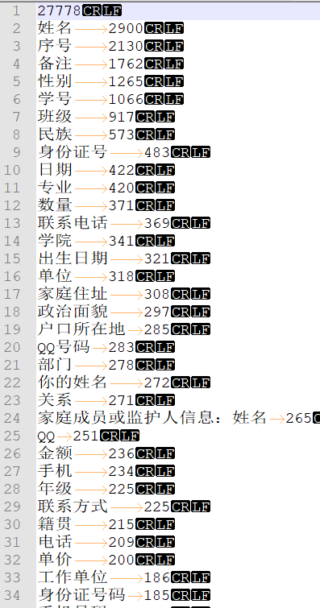

# table_header_recognise
## 一、data
1./data/result.txt：原有已知的表头，用来生成result_process.txt：

	file_name "\t" 表头

2./data/result_process.txt：从result.txt提取整合表头所生成的：

	file_name "\t" 表头

3./data/clean_table_process.txt：已经处理好的，第一行即为表头的：

	file_name "\t" 表头

4./data/statistics_word.txt：从result_process.txt和clean_table_process.txt统计表头词语的频率，后面的表头识别需要用到的数据，相当于作为字典查询。
	
5.unclean_table_process.txt：人为标注的，用来进行测试的数据test_data1：

	file_name "\t" 第几行是表头 "\t" 展示前5行（用"\t"隔开）

6.statistics.txt：

	file_name "\t" true_label "\t" predicted_label "\t" 
	展示前5行的词语在字典中的相似度

7.test_data2.txt：真实场景中的数据测试test_data2

8.clean_unclean_test_test2_data.zip：解压文件夹，包含了文件夹clean_tables, unclean_tables, test_data和test_data2

## 二、程序
1.statistics_predicte_tabel.py：测试用的主程序，用来通过规则计算表头在哪一行。

在输入中的几个文件：

（1）result_table和clean_table主要是用来生成统计字典stat_file

（2）unclean_table主要是用来进行测试的文件

参数说明：
（1）threshold：主要是用来控制“-1” label的生成，少于这个阈值，则说明在topN行中不存在表头。

2.statistics_table.py：这是测试用的第一版本，已经抛弃的

#####数据处理程序#######

3.null_header_generate.py：用来生成无表头的数据表格

4.data_process_clean_table.py：处理文件夹clean_table，并生成文件clean_table_process.txt

5.data_process_result.py：处理文件result.txt，并生成文件result_process.txt

6.data_process_unclean_table.py：处理文件夹unclean_tables,test_data和test_data2。用来生成文件unclean_table_process.txt, test_data.txt和test_data2.txt。

（1）其中参数N是用来保存该表格的topN行

## 三、思路

1.首先从已知的“干净”表格中，得到经常出现在表头的词语，然后根据这些表格统计这些词语经常出现的次数。即是从result_process.txt和clean_table_process.txt统计表头词语的频率，然后生成文件statistics.txt。



2.预测每一个表格中，哪一行是表头，其中“-1”代表无表头，从“0”开始代表第一行为表头，“1”代表第二行为表头，依此类推。

（1）预测公式（假设预测的是top5行）：

```
代码在statistics_predicte_tabel.py：
fre_rate = np.power(np.log(1 + frequent_num / all_frequent_num), 2)
sim_rate = float(word_in_stat_num) / len(words)
sim_rate = sim_rate * fre_rate
```

其中all_frequent_num是top5中出现在统计字典的所有词的频率，frequent_num是该行中出现在统计字典中的词的频率，word_in_stat_num是该行出现在统计字典中的词语个数，len(words)是该行的词语个数。

（2）最后得到每一行的预测值，把大于阈值的行数拿出来，并取最大预测值的那一行作为预测label。

## 四、[表头识别的分析结果](https://docs.qq.com/doc/DU0xNZ3FTdGVwdGxa)